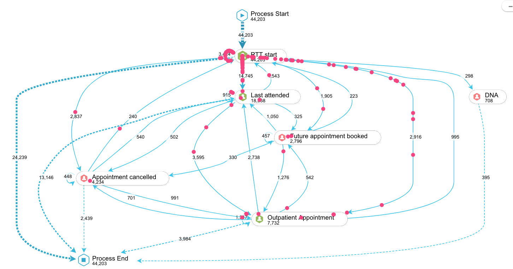

The NHS Python Community team met up with Qian Huang - Chief Impact Officer & Co-Founder @ [Logan Todd & Co.](https://www.logantod.net/) [[1](https://www.logantod.net/resources/accelerate-nhs-recovery-with-process-mining)] at the [Confed Expo in Liverpool](https://nhs-pycom.net/nhs-confed-expo) earlier this year to discuss the use of 'process mining' in the NHS.

## What is Process Mining

Process mining is a technique to analyse and monitor processes. A 'process' can be thought of as a collection of discrete activities or events. The end goal of process mining is to provide actionable operational insights and ultimately help optimise the whole process [[2](https://towardsdatascience.com/introduction-to-process-mining-5f4ce985b7e5)]. This can involve: 
- Identifying hidden nodes and bottlenecks in business processes
- Checking the conformance [[3]()] of a process to a reference model
- Making predictions about the future state of the process [[2](https://towardsdatascience.com/introduction-to-process-mining-5f4ce985b7e5)].
The method a well proven analytical technique and has seen widespread adoption in industry [[1](https://www.logantod.net/resources/accelerate-nhs-recovery-with-process-mining)].

**[[3]()]** "*Conformance*" is a metric that measures a whether process that falls within an acceptable limit.

### Process Mining in a Healthcare Setting

In a healthcare setting, process mining can be used to analyse patient pathways. For example, in elective care, patients start a pathway with a referral, moving them between different appointments and procedures, before completing their journey with a discharge [[1](https://www.logantod.net/resources/accelerate-nhs-recovery-with-process-mining)]. 

<figure class="nhsuk-image" style="width: 100%;">
  
  

    <figcaption class="nhsuk-image__caption">
        Figure 1. Example patient flow visualisation
    </figcaption>
  

</figure>

Figure 1. shows a visualisation of an example patient pathway developed using process mining. Qian and her team have found that once everybody can see the reality of the patient journey it is much easier to collaborate, identify appropriate actions, and deliver real improvement [[1](https://www.logantod.net/resources/accelerate-nhs-recovery-with-process-mining)].

    <a class="nhsuk-action-link__link" href="https://olobiotokoni.medium.com/write-or-die-fc8a081508b1">
        <svg class="nhsuk-icon nhsuk-icon__arrow-right-circle" xmlns="http://www.w3.org/2000/svg" viewBox="0 0 24 24" aria-hidden="true">
            <path d="M0 0h24v24H0z" fill="none"></path>
            <path d="M12 2a10 10 0 0 0-9.95 9h11.64L9.74 7.05a1 1 0 0 1 1.41-1.41l5.66 5.65a1 1 0 0 1 0 1.42l-5.66 5.65a1 1 0 0 1-1.41 0 1 1 0 0 1 0-1.41L13.69 13H2.05A10 10 0 1 0 12 2z"></path>
        </svg>
        Read: Using Process Mining to accelerate elective recovery in the NHS (Logan Todd & Co.)
    </a>

## Process Mining in Python

PM4Py styles it self as the state-of-the-art open-source process mining platform written in Python [[4](https://pm4py.fit.fraunhofer.de/)]. Developed by the [Fraunhofer Institute for Applied Information Technology (FIT)](http://fit.fraunhofer.de/). The advantage of PM4Py being a python library is that it allows for easy integration of process mining with other machine learning algorithms in scikit-learn.
  - [Installation](https://pm4py.fit.fraunhofer.de/install)
  - [Documentation](https://pm4py.fit.fraunhofer.de/docs)
  - [Jupyter Notebook tutorial](https://gitlab.com/healthcare2/process-mining-tutorial/-/tree/master)

<figure class="nhsuk-image">
  <iframe width="560" height="315" src="https://www.youtube-nocookie.com/embed/i6NGHvZyHXY" title="YouTube video player" frameborder="0" allow="accelerometer; autoplay; clipboard-write; encrypted-media; gyroscope; picture-in-picture" allowfullscreen></iframe>
  

    <figcaption class="nhsuk-image__caption">
       Video 1. Process Mining in Python | PyData Eindhoven 2019
    </figcaption>
  

</figure>

<figure class="nhsuk-image">
  <iframe width="560" height="315" src="https://www.youtube-nocookie.com/embed/XLHtvt36g6U" title="YouTube video player" frameborder="0" allow="accelerometer; autoplay; clipboard-write; encrypted-media; gyroscope; picture-in-picture" allowfullscreen></iframe>
  

    <figcaption class="nhsuk-image__caption">
       Video 2. pm4py tutorials - What is Process Mining
    </figcaption>
  

</figure>

### Other Python PM Resources

- [Awesome Process Mining with Python Awesome](https://github.com/TheWoops/awesome-processmining) [[5](https://github.com/TheWoops/awesome-processmining)]
- Process Mining with Python tutorial: A Healthcare Application by 'c3d3'[[6](https://medium.com/@c3_62722/process-mining-with-python-tutorial-a-healthcare-application-part-1-ae02027a050)];
  - [Part 1](https://medium.com/@c3_62722/process-mining-with-python-tutorial-a-healthcare-application-part-1-ae02027a050): Introduction, preprocessing and data exploration.
  - [Part 2](https://medium.com/@c3_62722/process-mining-with-python-tutorial-a-healthcare-application-part-2-4cf57053421f): Process discovery using the PM4Py library.
  - [Part 3](https://medium.com/@c3_62722/process-mining-with-python-tutorial-a-healthcare-application-part-3-cc9af986c122): Other process discovery algorithms and model representations.
  - [Part 4](https://medium.com/@c3_62722/process-mining-with-python-tutorial-a-healthcare-application-part-4-912286ee51b): Control flow, bottlenecks, wait times, capacity, and case attributes. 

## References

- Qian Huang. 2021. "Using Process Mining to accelerate elective recovery in the NHS." [Online] Available at: [https://www.logantod.net/resources/accelerate-nhs-recovery-with-process-mining](https://www.logantod.net/resources/accelerate-nhs-recovery-with-process-mining). Logan Todd & Co.

- Awesome Process Mining. 2019. [Online] Available at: [https://github.com/TheWoops/awesome-processmining](https://github.com/TheWoops/awesome-processmining)

- Eryk Lewinson. 2020. "Introduction to Process Mining" [Online] Available at: [https://towardsdatascience.com/introduction-to-process-mining-5f4ce985b7e5](https://towardsdatascience.com/introduction-to-process-mining-5f4ce985b7e5). 

- c3d3. 2020. "Process Mining with Python tutorial: A healthcare application — Part 1." [Online] Available at: [https://medium.com/@c3_62722/process-mining-with-python-tutorial-a-healthcare-application-part-1-ae02027a050](https://medium.com/@c3_62722/process-mining-with-python-tutorial-a-healthcare-application-part-1-ae02027a050).

- [Fraunhofer Institute for Applied Information Technology (FIT)](http://fit.fraunhofer.de/). 2022. "PM4PY: State-of-the-art-process mining in Python". Application. [Online] Available at: [https://pm4py.fit.fraunhofer.de/](https://pm4py.fit.fraunhofer.de/).
